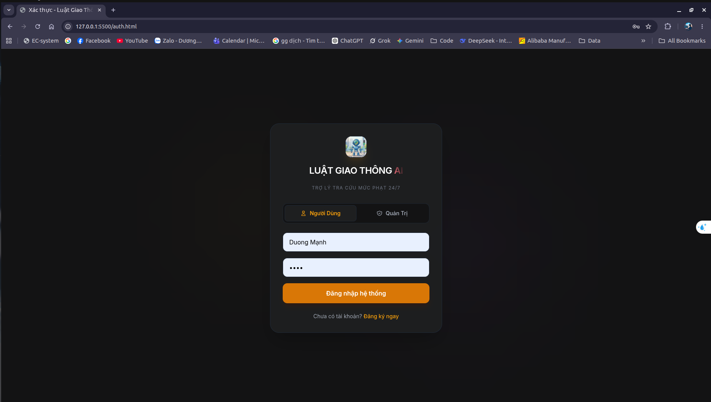
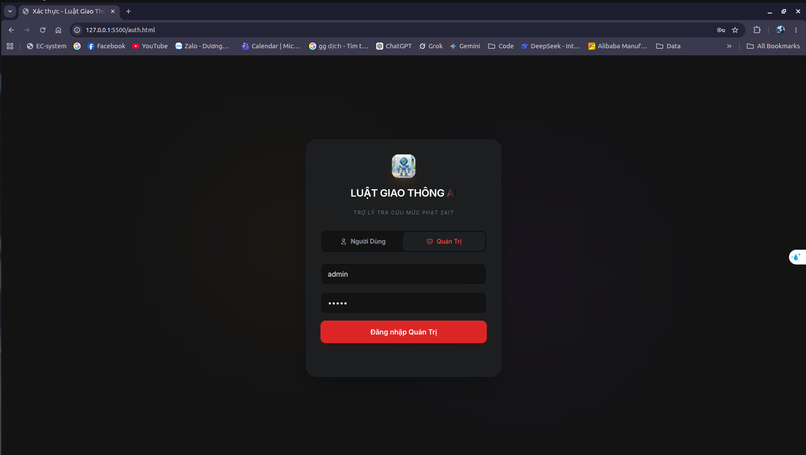
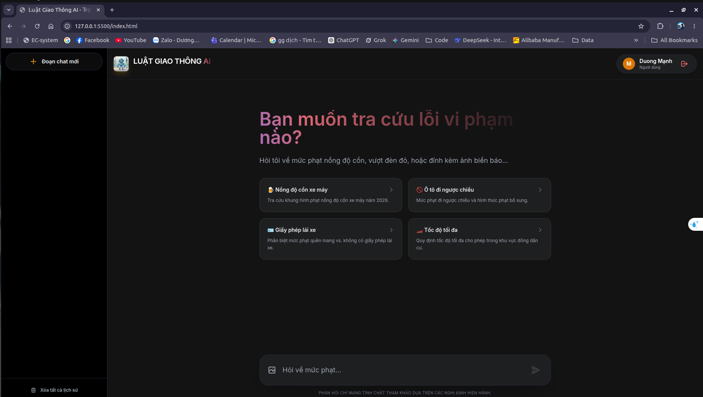
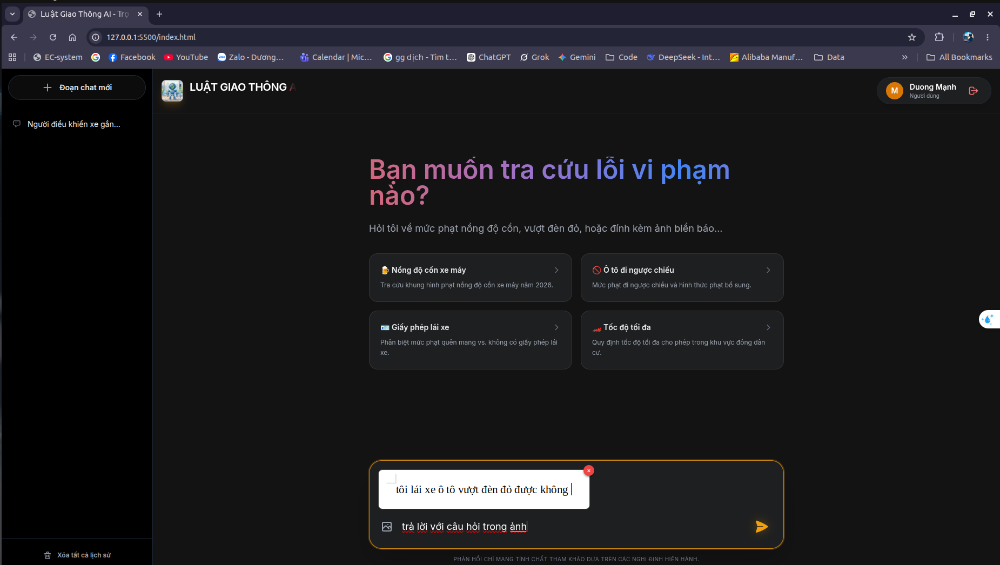
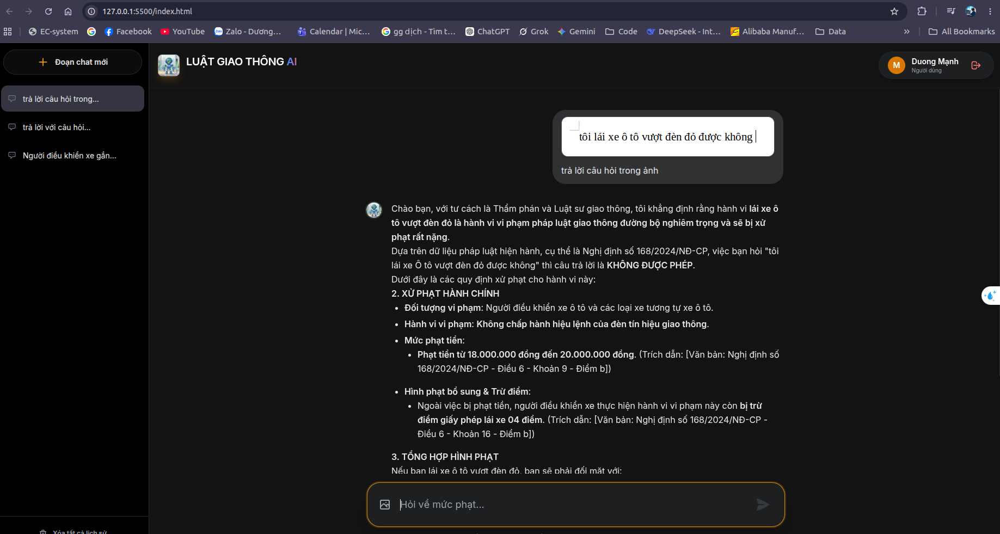
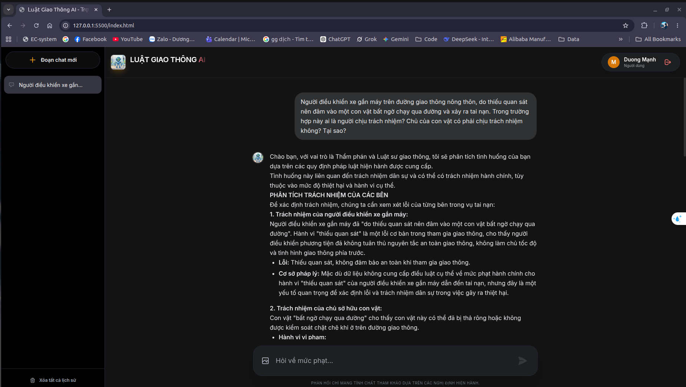
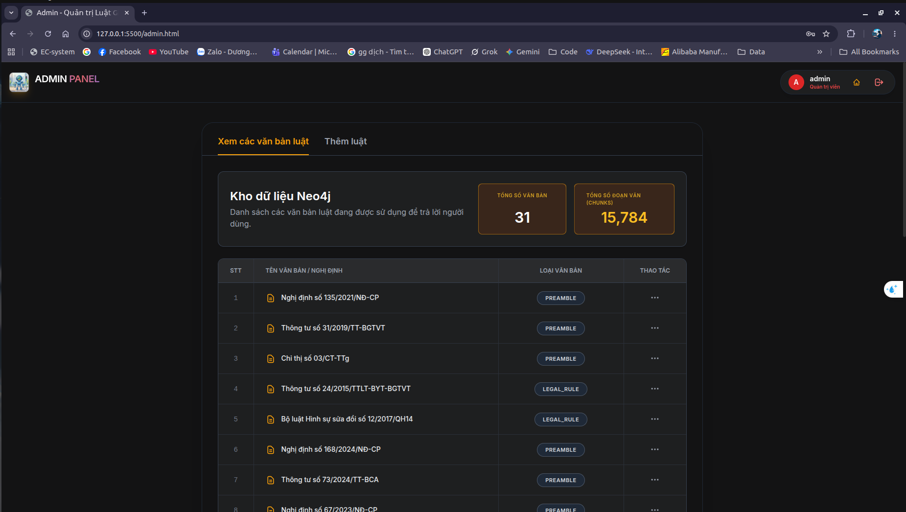
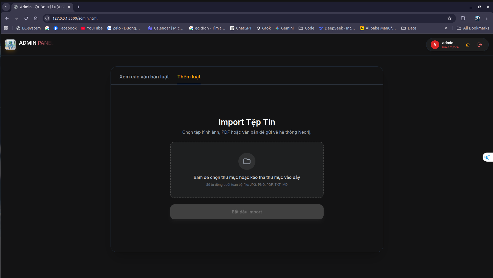

<h1 align="center">⚖️ Vietnam Road Traffic Law Chatbot <br> <i>(Advanced Graph-RAG Architecture)</i></h1>

<p align="center">
  
  
  
  
  
</p>

## 📖 Overview
This project is an enterprise-level **Legal Hybrid Graph-RAG System** designed to act as an intelligent assistant for Vietnam's Road Traffic Laws. 

Moving beyond standard Semantic RAG systems that often suffer from hallucinations and context fragmentation, this architecture leverages a **Knowledge Graph (Neo4j)**, **Graph Representation Learning (GraphSAGE)**, and a **Custom CPU-optimized OCR Engine** to ensure 100% fact-grounded, multi-dimensional legal reasoning.

## ✨ Key Technical Highlights

### 1. Custom OCR Engine inside IBM Docling (CPU-Optimized)
Standard OCR tools (EasyOCR/Tesseract) often fail to preserve complex table structures or struggle with Vietnamese diacritics. 
* **Solution:** Deeply customized IBM's `Docling` core by replacing its default OCR with a dual-stage pipeline: **YOLOv8** (for layout analysis) + **Lightweight CRNN** (fine-tuned for Vietnamese).
* **Result:** Achieved 98% accuracy on scanned PDFs, preserving 100% of table topologies and Markdown structures while running smoothly on CPU environments with a 40% RAM reduction.

### 2. Fault-Tolerant Knowledge Graph ETL
* **Batched Multi-threading:** Orchestrated thousands of API calls to Gemini Pro for Entity/Relationship extraction using parallel processing.
* **Checkpointing & State Management:** Implemented Exponential Backoff and local staging mechanisms to gracefully handle API Rate Limits (429) and Timeouts (504) without losing a single token.
* **Backward Context Tracing:** Developed rule-based algorithms (Regex) to resolve isolated legal cross-references (e.g., converting *"violating point a, clause 1"* into its absolute semantic meaning), eliminating "dangling nodes" in the graph.

### 3. Graph Machine Learning & Hybrid Retrieval
* **Global Entity Deduplication:** Used Cypher `UNWIND` to merge entities globally, transforming isolated documents into a deeply interconnected web of legal knowledge.
* **GraphSAGE Integration:** Trained a Neural Graph Model via Neo4j Graph Data Science (GDS) to fuse 1024-dimensional Vietnamese text embeddings with the structural topology of the legal system.
* **Anti-Hallucination Routing:** Combined Dense Vector Search, Full-text Search, and Sibling-node Traversal (fetching full parent clauses) under strict LLM meta-prompting to guarantee 0% hallucination. Includes heuristic routing specifically for criminal liability cases.

### 4. Stateful API Gateway & Multimodal UI
* **Flask Controller:** Manages asynchronous batch folder ingestion protected by strict **Admin-only** SQLite role-based authentication.
* **SSE Real-time Streaming:** Delivers fluid, low-latency text generation to the frontend using Server-Sent Events.
* **Multimodal Fallback:** Supports image uploads (e.g., traffic signs, penalty tickets) seamlessly integrated with OpenCV and the OCR pipeline for visual-question answering.

---

## 💻 System Architecture

1. **Ingestion Layer:** Docling Core + Custom YOLOv8/CRNN
2. **Extraction Layer:** Gemini Pro (Strict JSON Prompts) + Python Cleaners
3. **Storage & ML Layer:** Neo4j + Vector Index + GraphSAGE (GDS)
4. **Application Layer:** Flask REST/Streaming API + Minimalist Dark Theme UI

---
## 📸 Screenshots

### 1. Authentication & Role Routing
<p align="center">
  
  
</p>

> **Dynamic Theme Switching:** Warm Orange for regular users, and Crimson Red to indicate elevated privileges for Administrators.

### 2. Intelligent Legal Chatbot Interface
<p align="center">
  
</p>

> **Minimalist Dark Theme:** Features Sidebar Memory and Quick-action recommendation prompts (Zero-friction UX).

### 3. Multimodal Reasoning (Image + Text Input)
<p align="center">
  
  
</p>

> **Visual-Question Answering:** Users can upload images combined with text. The system extracts text via the Custom OCR engine and feeds it to the GraphRAG pipeline for unified reasoning.

### 4. Detailed Legal Analysis Generation
<p align="center">
  
</p>

> **Scenario-based Reasoning:** The LLM acts as a Legal Expert/Judge, breaking down complex scenarios based strictly on the Neo4j Knowledge Graph to prevent hallucinations.

### 5. Secure Admin Control Panel
<p align="center">
  
  
</p>

> **Admin-only Zone:** Displays live Neo4j metrics (Nodes/Chunks), precise document structure tracking, and a secure drag-and-drop zone for batch folder ingestion.

---

## 🚀 Getting Started

### Prerequisites
* Python 3.10+
* Neo4j Desktop / AuraDB (with APOC and GDS plugins enabled)
* Gemini API Key

### Installation

1. **Clone the repository:**
   ```bash
   https://github.com/duongmanh27/Vietnam-Road-Traffic-Law-Chatbot.git```
2. **Install dependencies:**
```bash
   pip install -r requirements.txt
```
3. **Configure Environment Variables:**
```bash
GEMINI_API_KEY=your_gemini_key_here
NEO4J_URI=bolt://localhost:7687
NEO4J_USER=neo4j
NEO4J_PASSWORD=your_password
```
4. **Run the Application:**
```bash
python app.py
```
👨‍💻 Author & Contact
Dương Mạnh AI / Data Engineer Passionate about System Design, Graph Databases, and applied Machine Learning.

💡 Note on Model Weights:
The pre-trained weights for the custom OCR models (YOLOv8 & CRNN) and GraphSAGE are not included in this repository due to size limitations and intellectual property. If you would like to obtain the **FREE** model weights to fully run this system, please feel free to contact me via email at:
📧 duongmanh608@gmail.com
Link drive: https://drive.google.com/drive/folders/1g40KVVZwcCJIifaaxU8GXI_iCjD1VV0h?usp=sharing
⭐️ If this project helped you, please give it a star! Thanks a lot! ⭐️
